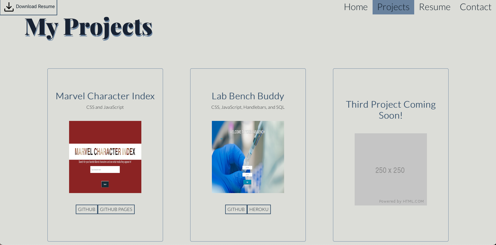

# React Portfolio 

## Description 
This application is the MVP of my portfolio using React. 

## Table of Contents 
[Usage](#usage)  
[Road Map](#road-map)  
[License](#license)  
[Status](#status)

## Usage 
When the application opens, the user will see the homepage, that functions as the about me. 

At the top of the page is a header, a navigation bar, and a button that allows the user to download my resume. These three features, as well as the footer, will persist as the user changes pages. 

If the user clicks on the github, linked in, or instagram icons at the bottom of the page, they will be directed to my public pages for each site.  
The user can then select the projects tab where they can see a select few of my projects completed and one project to be completed in the future. Each project contains the link to its associated github repository, and a link to its github pages or heroku deployment, if applicable. 

The user then selects the resume tab, which outlines the main points of my full resume as well as gives a detailed list of my front end and back end coding knowledge. The button to download my full resume remains at the top of the page at the opposite end of the navigation menu. 

Finally, the user can choose to contact me if they'd like more information or just want to say hello! On the contact page, the user is directed to fill out their name, an email, and a message. 

If their name or email is invalid upon submission, an error message will occur. 

If the user did not fill out a message upon submission, an error message will occur. 

This serves as a reminder to the user that these three fields are required to submit the contact form. 

## Road Map 
Future iterations of this project will include a better mobile first user interface as well as a working Download Resume button. 

## License 
[MIT](https://choosealicense.com/licenses/mit/)

## Status
